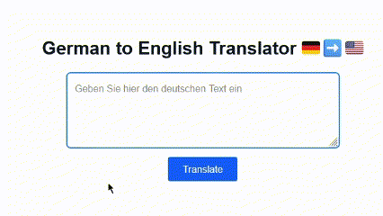

# German-to-English Translator (Next.js + FastAPI + Tensorflow)

A simple and clean web interface to translate German text to English using a custom-trained Transformer model from scratch [repo](https://github.com/kozuedoingregression/attention-is-all-you-need) and accessed through an API built with FastAPI backend [repo](https://github.com/kozuedoingregression/attention-api).

## Features

- Translate German text to English via API
- Frontend built with Next.js and Tailwind CSS
- Backend with FastAPI
## Demo
<p align="center">
    
</p>

## Backend API (FastAPI) [(repo)](https://github.com/kozuedoingregression/attention-api)

The frontend expects a POST endpoint at:

```
POST /translate
Content-Type: application/json
Body: { "text": "Ich bin klug" }
```

Response:
```json
{ "translation": "I am smart" }
```

---
